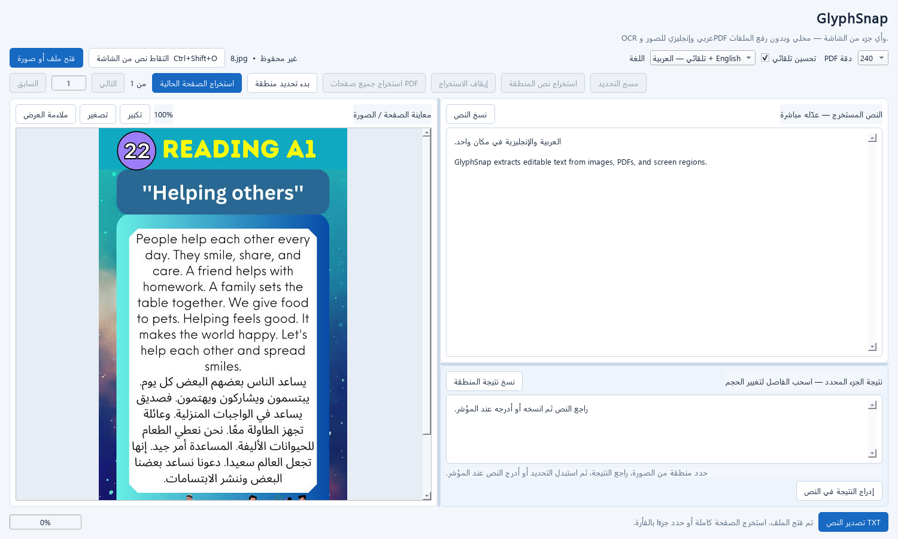

# GlyphSnap

GlyphSnap is a privacy-first Windows desktop OCR tool for Arabic, English, and mixed
text. It extracts editable text from images, PDFs, selected image regions, or any area
of the screen without uploading files.



## Features

- Arabic, English, and combined Arabic + English OCR
- System-wide `Ctrl + Shift + O` screen-region capture
- Native-resolution, DPI-aware capture across multiple monitors
- Image and multi-page PDF support
- Adaptive OCR candidate selection using confidence and text coverage
- Optional deskew, contrast normalization, denoising, thresholding, and upscaling
- Bidirectional review editor, clipboard copy, and UTF-8 export
- Fully local processing with Tesseract

## Requirements

- Windows 10 or 11
- Python 3.13+
- [Tesseract OCR for Windows](https://github.com/UB-Mannheim/tesseract/wiki)
- Tesseract language data: `ara` and `eng`

Verify the language installation:

```powershell
tesseract.exe --list-langs
```

## Development setup

```powershell
git clone <repository-url> GlyphSnap
cd GlyphSnap
py -3.13 -m venv .venv
.\.venv\Scripts\Activate.ps1
python -m pip install -r requirements.txt
python glyphsnap.py
```

## Usage

1. Choose **Open image or PDF**, or press `Ctrl + Shift + O` from any application.
2. Keep **Auto — Arabic + English** unless the source contains one language only.
3. Extract the full page or select a smaller region.
4. Review the confidence indicator and edit the recognized text if needed.
5. Copy the result or export it as UTF-8 text.

The screen overlay is dimmed only for selection. OCR receives the untouched physical
screen pixels, including on high-DPI displays.

## Tests and accuracy evaluation

The regression dataset in `tests/` covers Arabic, English, mixed text, small text,
screen-like images, and dense pages. The benchmark reports character similarity,
word similarity, missing-token coverage, and punctuation recall.

```powershell
python -m unittest discover -v
python benchmark_ocr.py --output test-results\accuracy.json
python ui_smoke_test.py
```

Ground-truth discrepancies are documented in
[`tests/REFERENCE_NOTES.md`](tests/REFERENCE_NOTES.md); expected text is never changed
to make tests pass. See the reproducible [accuracy report](docs/accuracy-report.md) for
the before/after comparison.

## Architecture

| Component | Purpose |
| --- | --- |
| `glyphsnap_app.py` | PySide6 desktop UI and asynchronous workflows |
| `screen_capture.py` | Native-resolution capture and Windows global hotkey |
| `ocr_engine.py` | Multilingual OCR, preprocessing, and candidate selection |
| `ocr_metrics.py` | CER/WER-style evaluation and coverage metrics |
| `glyphsnap_advanced.py` | Optional PaddleOCR document-layout research pipeline |

## Technology

Python, PySide6, Tesseract, OpenCV, Pillow, PyMuPDF, NumPy, and optional PaddleOCR.

## License

MIT © 2026 Ali Alnazer Ahmed.
